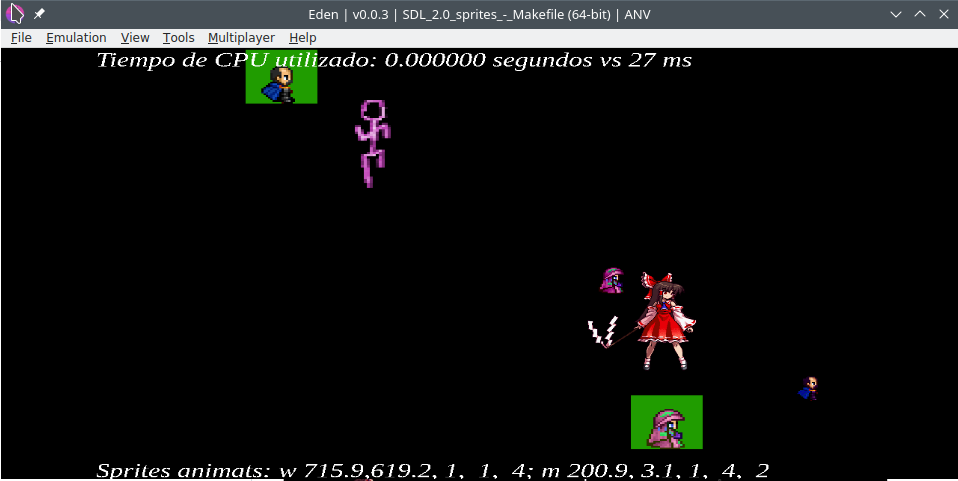

<!--
Sintaxis README
https://docs.github.com/es/get-started/writing-on-github/getting-started-with-writing-and-formatting-on-github/basic-writing-and-formatting-syntax#hiding-content-with-comments

Tokens
https://docs.github.com/es/authentication/keeping-your-account-and-data-secure/managing-your-personal-access-tokens
-->
# Switch-homebrew-development
Homebrew examples for Switch platform from "videoconsole development" subject.

Thanks to the creators and maintainers of [devkitPro](https://devkitpro.org/), and specially to  Drunken Coders, mtheall, sgstair, WinterMute, Patater, smea, AntonioND, fincs ( ͡° ͜ʖ ͡°) and PabloMK7.

Also thanks to the creators and maintainers of Switch emulators such as Yuzu (RIP), Ryujinx, and Suyu. And to the creators and maintainers of documentation SwitchBrew,

Contents of this repo:
- [Using Box2D plus SDL 2.0 on Switch](https://github.com/magusti/Switch-homebrew-development#using-box2d-plus-sdl-20-on-switch).
+ [Using sprites on SDL 2.0 on Switch](https://github.com/magusti/Switch-homebrew-development#using-sprites-on-sdl-20-on-switch).
+ [Using framebuffer in Switch](https://github.com/magusti/Switch-homebrew-development#using-framebuffer-i-switch).
+ [EGL on Switch](https://github.com/magusti/Switch-homebrew-development#egl-on-switch).
+ [OpenGL ES on Switch](https://github.com/magusti/Switch-homebrew-development#opengl-es-on-switch).
* [Compatibiliy text mode on Switch and PC](https://github.com/magusti/Switch-homebrew-development#compatibiliy-text-mode-on-switch-and-pc).
* [Disponibility of OpenAL on Switch by OpenAL Soft](https://github.com/magusti/Switch-homebrew-development#disponibility-of-openal-on-switch-by-openal-soft).
* [Matrix effect on Switch](https://github.com/magusti/Switch-homebrew-development#matrix-effect-on-switch).
* [Using sprites animates on Switch with SDL2.0](https://github.com/magusti/Switch-homebrew-development#using-sprites-animates-on-switch-with-sdl20).

<!--
- Using Box2D plus SDL 2.0 on Switch [Switch__SDL2_0_box2D](https://github.com/magusti/Switch-homebrew-development#switch__sdl2_0_box2d).
+ Using sprites on SDL 2.0 on Switch [Switch__SDL2_0_sprites](https://github.com/magusti/Switch-homebrew-development#switch__sdl2_0_sprites).
+ Using framebuffer in Switch [Switch__framebuffer](https://github.com/magusti/Switch-homebrew-development#switch_framebuffer).
+ EGL on Switch [Switch__egl](https://github.com/magusti/Switch-homebrew-development#switch_egl).
+ OpenGL ES on Switch [Switch_opengles](https://github.com/magusti/Switch-homebrew-development#switch_opengles).
* Compatibiliy text mode on Switch and PC [Switch__textModoCompat](https://github.com/magusti/Switch-homebrew-development#switch__textmodocompat).
* Disponibility of OpenAL on Switch by OpenAL Soft [Switch__OpenAL_openalinfo](https://github.com/magusti/Switch-homebrew-development#switch__openal_openalinfo).
* Matrix effect on Switch [Switch_efecteMatrix](https://github.com/magusti/Switch-homebrew-development#switch_efectematrix).
* Using sprites animates on Switch with SDL2.0 [Switch__SDL2_0_AnimateSprites](https://github.com/magusti/Switch-homebrew-development#switch__sdl2_0_animatesprites).
-->

<!-- 
Plantilla entrada
* Títol de l'article [Titol de l'entrada__conter_que_No_seParegaen el sprimer 16 o poc més caracters](URL).
-->

<!-- ## Switch__SDL2_0_box2D -->
## Using Box2D plus SDL 2.0 on Switch 

The SDL 2.0 version of *box2D* example rewrited from **3ds-examples** on  repo [3DS__SDL1_2_box2D](https://github.com/magusti/3DS-homebrew-development#3ds_sdl1_2_sprites).

Screenshot of Switch example *physics/box2d* using SDL 2.0.

Commented in [M. Agustí. (2024). Revisión de un ejemplo de uso de Box2D. Caso de uso en plataformas 3DS, Switch y PC. Universitat Politècnica de València](https://riunet.upv.es/handle/10251/205542).

<!-- ## Switch__SDL2_0_sprites -->
## Using sprites on SDL 2.0 on Switch

The SDL 2.0 version of *gpusprites* example from **3ds-examples**.

Screenshot of Switch example *graphics/gpu/gpusprites* rewriting the graphic interface using SDL 2.0 using (a) 768 y (b) 1024 sprites.

[Related to 3DS example](https://github.com/magusti/3DS-homebrew-development#3ds_sdl1_2_sprites).

Commented in [M. Agustí. (2024). Adaptación de un ejemplo de uso nativo de sprites de 3DS a Switch utilizando SDL. Universitat Politècnica de València](http://hdl.handle.net/10251/204863).

<!-- ## Switch_framebuffer --> 
## Using framebuffer in Switch 

Screenshot of Switch example *graphics/simplegfx* using images.

Commented in [M. Agustí. (2024). Acceso al framebuffer en la plataforma Nintendo Switch.]( http://hdl.handle.net/10251/205689).

<!-- ## Switch_egl -->
## EGL on Switch 

Screenshot of EGL Switch Arquitecture (left) and Switch EGL example *graphics/simple_triangle* ported to PC (right).

Commented in [M. Agustí. (2025). Introducción al uso de EGL en aplicaciones portables para la videoconsola Nintendo Switch y Linux](https://riunet.upv.es/handle/10251/222915).

<!-- ## Switch_opengles -->
## OpenGL ES on Switch

Screenshot of OpenGL ES Switch example *graphics/opengl/es2gears* (left) ported to PC (right).

Commented in [M. Agustí. (2025). Portabilidad de aplicaciones basadas en OpenGL ES entre plataforma N. Switch y Linux. Universitat Politècnica de València](https://riunet.upv.es/handle/10251/221098).

<!-- ## Switch__textModoCompat --> 
## Compatibiliy text mode on Switch and PC 

Screenshot of Compatibility text mode on Switch and PC.

Commented in [M. Agustí. (2025). Aplicaciones en modo texto: portabilidad entre plataformas Switch y PC](https://riunet.upv.es/handle/10251/221558).

<!-- ## Switch__OpenAL_openalinfo -->
## Disponibility of OpenAL on Switch by OpenAL Soft

Screenshot of information about OpenAL on Switch by OpenAL Soft.

Commented in [M. Agustí. (2025). Uso de OpenAL en plataforma Switch: OpenAL Soft](https://riunet.upv.es/handle/10251/221432).
   

<!-- ## Switch_efecteMatrix -->
## Matrix effect on Switch

Screenshot of my Matrix effect on Switch 
.

Code in [efecteMatrix_Switch](https://github.com/magusti/Switch-homebrew-development/tree/main/efecteMatrix_Switch)

<!-- Commented in ... -->
In process...

<!-- ## Switch__SDL2_0_AnimateSprites -->
## Using sprites animates on Switch with SDL2.0

Screenshot of NDS style and 3DS sprite animation techniques styles ported to Switch.

Code in [Switch__SDL2_0_spritesAnimate](https://github.com/magusti/Switch-homebrew-development/tree/main/Switch__SDL2_0_spritesAnimate)

References:
 * Exemple from NDS devkitPro (Graphics/Sprites/animate_simple_NDS)
 * NDS/Tutorials Animation  / Dev-Scene.com . Copia en <https://d2l62mv7qj2i3f.cloudfront.net/NDS/Tutorials_Animation>
 * "Simple basic animation using the citro2d library" - GitHub <https://github.com/NyankoTear/reimu_idle/blob/main/README.md>

<!-- Commented in ... -->
In process...

<!-- 
Plantilla apartat; conter espais en blanc de separació o no i simbols

## Titol
Text,  de l'entrada
|[Text de l'entrada.](efecteMatrix_3DS/efecteMatrix_3DS.png).

< ! -- Commented in ... -- >
In process...

-->
