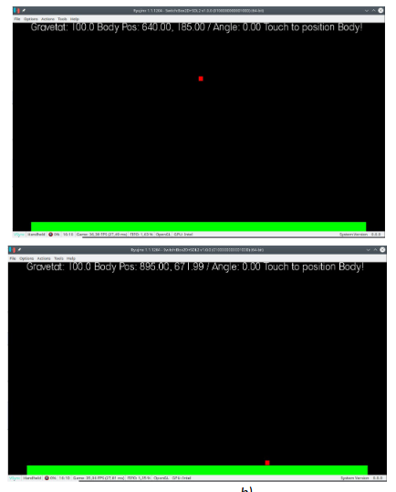
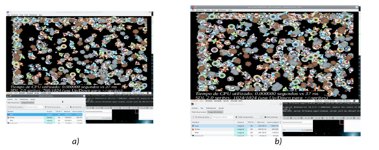
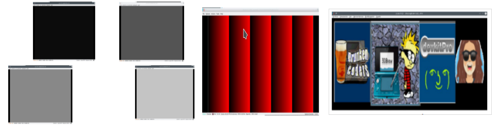
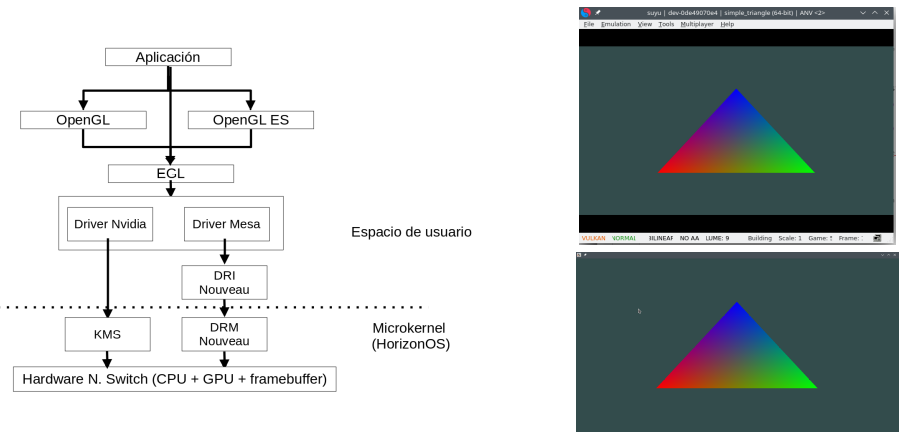
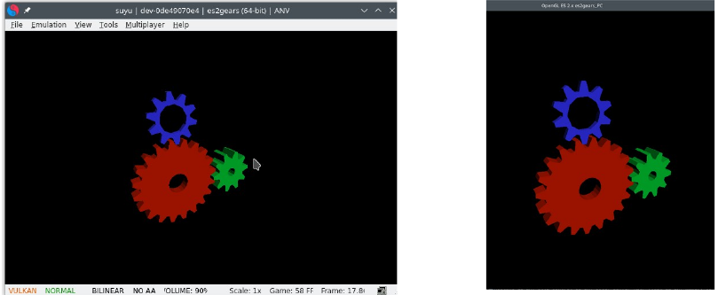
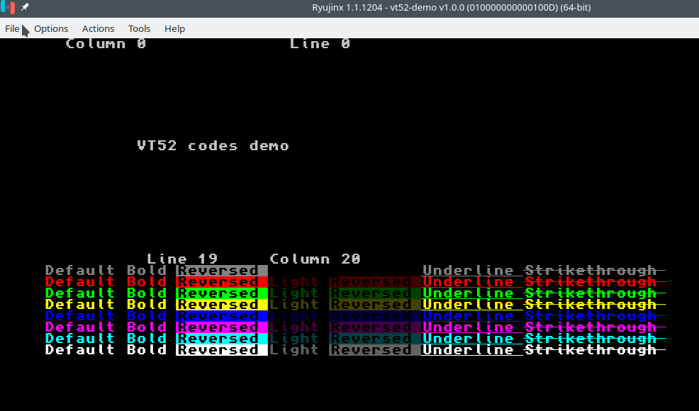
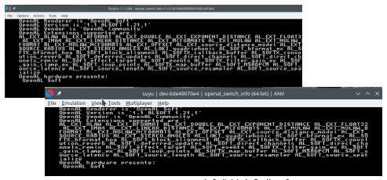
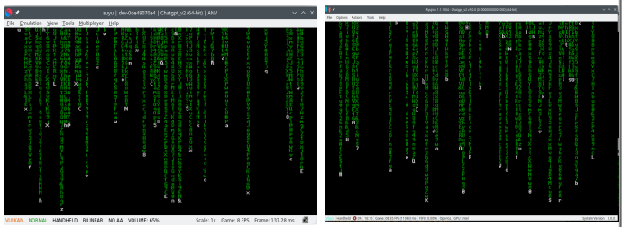
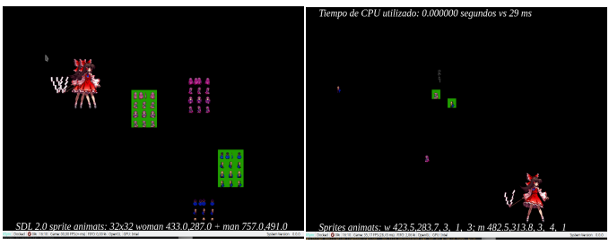

<!--
Sintaxis README
https://docs.github.com/es/get-started/writing-on-github/getting-started-with-writing-and-formatting-on-github/basic-writing-and-formatting-syntax#hiding-content-with-comments

Tokens
https://docs.github.com/es/authentication/keeping-your-account-and-data-secure/managing-your-personal-access-tokens
-->
# Switch-homebrew-development
Homebrew examples for Switch platform from "videoconsole development" subject.

Thanks to the creators and maintainers of [devkitPro](https://devkitpro.org/), and specially to  Drunken Coders, mtheall, sgstair, WinterMute, Patater, smea, AntonioND, fincs ( ͡° ͜ʖ ͡°) and PabloMK7.

Also thanks to the creators and maintainers of Switch emulators such as Yuzu (RIP), Ryujinx, and Suyu. And to the creators and maintainers of documentation SwitchBrew,

Contents of this repo:
- Using Box2D plus SDL 2.0 on Switch [Switch__SDL2_0_box2D](https://github.com/magusti/Switch-homebrew-development/tree/main#switch__sdl2_0_box2d).
+ Using sprites on SDL 2.0 on Switch [Switch__SDL2_0_sprites](https://github.com/magusti/Switch-homebrew-development/tree/main#switch__sdl2_0_sprites).
+ Using framebuffer in Switch [Switch__framebuffer](https://github.com/magusti/Switch-homebrew-development/tree/main#switch_framebuffer).
+ EGL on Switch [Switch__egl](https://github.com/magusti/Switch-homebrew-development/tree/main#switch_egl).
+ OpenGL ES on Switch [Switch_opengles](https://github.com/magusti/Switch-homebrew-development/tree/main#switch_opengles).
* Compatibiliy text mode on Switch and PC [Switch__textModoCompat](https://github.com/magusti/Switch-homebrew-development/tree/main#switch__textmodocompat).
* Disponibility of OpenAL on Switch by OpenAL Soft [Switch__OpenAL_openalinfo](https://github.com/magusti/Switch-homebrew-development/tree/main#switch__openal_openalinfo).
* Matrix effect on Switch [Switch_efecteMatrix](https://github.com/magusti/Switch-homebrew-development/tree/main#switch_efectematrix).
* Using sprites animates on Switch with SDL2.0 [Switch__SDL2_0_AnimateSprites](https://github.com/magusti/Switch-homebrew-development/tree/main#switch__sdl2_0_animatesprites).

<!-- 
Plantilla entrada
* Títol de l'article [Titol de l'entrada__conter_que_No_seParegaen el sprimer 16 o poc més caracters](URL).
-->

## Switch__SDL2_0_box2D
The SDL 2.0 version of *box2D* example rewrited from **3ds-examples** on  repo [3DS__SDL1_2_box2D](https://github.com/magusti/3DS-homebrew-development#3ds_sdl1_2_sprites).

Screenshot of Switch example *physics/box2d* using SDL 2.0.

## Switch__SDL2_0_sprites
The SDL 2.0 version of *gpusprites* example from **3ds-examples**.

Screenshot of Switch example *graphics/gpu/gpusprites* rewriting the graphic interface using SDL 2.0 using (a) 768 y (b) 1024 sprites.

[Related to 3DS example](https://github.com/magusti/3DS-homebrew-development#3ds_sdl1_2_sprites).

Comented in [M. Agustí. (2024). Adaptación de un ejemplo de uso nativo de sprites de 3DS a Switch utilizando SDL. Universitat Politècnica de València](http://hdl.handle.net/10251/204863).

## Switch_framebuffer
Screenshot of Switch example *graphics/simplegfx* using images.

Comented in [M. Agustí. (2024). Acceso al framebuffer en la plataforma Nintendo Switch.]( http://hdl.handle.net/10251/205689).

## Switch_egl
Screenshot of EGL Switch Arquitecture (left) and Switch EGL example *graphics/simple_triangle* ported to PC (right).

Comented in ...
In process...

## Switch_opengles
Screenshot of OpenGL ES Switch example *graphics/opengl/es2gears* (left) ported to PC (right).

Comented in ... (https://riunet.upv.es/handle/10251/221098)
In process... 

## Switch__textModoCompat
Screenshot of Compatibility text mode on Switch and PC.

In process...

## Switch__OpenAL_openalinfo
Screenshot of information about OpenAL on Switch by OpenAL Soft.

In process...
   

## Switch_efecteMatrix
Screenshot of my Matrix effect on Switch 
.

<!-- Comented in ... -->
In process...

## Switch__SDL2_0_AnimateSprites
Screenshot of NDS style and 3DS sprite animation techniques styles ported to Switch.

<!-- 
Plantilla apartat; conter espais en blanc de separació o no i simbols

## Titol
Text,  de l'entrada
|[Text de l'entrada.](efecteMatrix_3DS/efecteMatrix_3DS.png).

< ! -- Comented in ... -- >
In process...

-->
