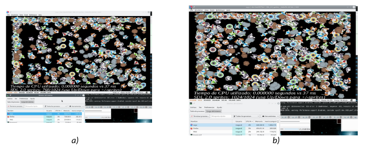

<!--
Sintaxis README
https://docs.github.com/es/get-started/writing-on-github/getting-started-with-writing-and-formatting-on-github/basic-writing-and-formatting-syntax#hiding-content-with-comments

Tokens
https://docs.github.com/es/authentication/keeping-your-account-and-data-secure/managing-your-personal-access-tokens
-->
# Switch-homebrew-development
Homebrew examples for Switch platform from "videoconsole development" subject.
Thanks to the creators and maintainers of [devkitPro](https://devkitpro.org/), and specially to  Drunken Coders, mtheall, sgstair, WinterMute, Patater, smea, AntonioND, fincs ( ͡° ͜ʖ ͡°) and PabloMK7.
Also thanks to the creators and maintainers of Switch emulators such as Yuzu (RIP), Ryujinx, and Suyu. And to the creators and maintainers of documentation

Contents of this repo: 'rgb(255,0,0)TO DO'
- Using Box2D plus SDL 2.0 on Switch [Switch__SDL2_0_box2D]().
* Using sprites on SDL 2.0 on Switch [Switch__SDL2_0_sprites]().
+ Using framebuffer in Switch [Switch__framebuffer]().

## Switch__SDL2_0_box2D
The SDL 2.0 version of *box2D* example rewrited from **3ds-examples** on  repo [3DS__SDL1_2_box2D](https://github.com/magusti/3DS-homebrew-development#3ds_sdl1_2_sprites).

Screenshot of Switch example *physics/box2d* using SDL 2.0.

## Switch__SDL2_0_sprites
The SDL 2.0 version of *gpusprites* example from **3ds-examples**.

Screenshot of Switch example *graphics/gpu/gpusprites* rewriting the graphic interface using SDL 2.0 using (a) 768 y (b) 1024 sprites.

[Related to 3DS example](https://github.com/magusti/3DS-homebrew-development#3ds_sdl1_2_sprites).

Comented in [M. Agustí. (2024). Adaptación de un ejemplo de uso nativo de sprites de 3DS a Switch utilizando SDL. Universitat Politècnica de València](http://hdl.handle.net/10251/204863).

## Switch_framebuffer
Screenshot of Switch example *graphics/simplegfx* using images.

Comented in [M. Agustí. (2024). Acceso al framebuffer en la plataforma Nintendo Switch.]( http://hdl.handle.net/10251/205689).
